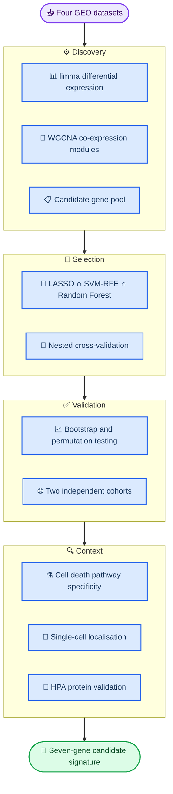

# Disulfidptosis-associated signature in diabetic nephropathy

Analysis code and results for a computational study of disulfidptosis-related transcriptional programs in diabetic nephropathy (DN), integrating four public transcriptomic datasets, a triple-algorithm biomarker selection strategy, and cell death pathway specificity analysis.

The study's central finding is negative-turned-informative: the "disulfidptosis-related" signature in DN does **not** reflect disulfidptosis pathway activation, but convergent perturbation of actin cytoskeleton and oxidative stress programs.

[](https://doi.org/10.5281/zenodo.23170443)

---

## 📋 Contents

- [Background](#-background)
- [Key findings](#-key-findings)
- [Analytical workflow](#-analytical-workflow)
- [Repository layout](#-repository-layout)
- [Data](#-data)
- [Reproducing the analysis](#-reproducing-the-analysis)
- [Figure index](#-figure-index)
- [Scope, decisions and limitations](#-scope-decisions-and-limitations)
- [Manuscript](#-manuscript)
- [How to cite](#-how-to-cite)
- [References](#-references)

---

## 🔬 Background

Disulfidptosis is a regulated cell death modality described in 2023: under NADPH limitation, accumulated intracellular cystine forms aberrant disulfide bonds between actin cytoskeletal proteins, collapsing the actin network [^1]. The renal proximal tubule is a site of intense cystine handling via SLC3A2/SLC7A11, and the oxidative stress and NADPH depletion of diabetes are mechanistically compatible with this death program — making DN a plausible context for disulfidptosis-related biology.

Two prior studies reported disulfidptosis-related biomarker panels in DN [^2][^3] and shared two methodological limitations: both relied on one or two feature-selection algorithms applied to a single gene set (so single-method false-discovery risk is uncontrolled), and neither tested whether the resulting signature reflects disulfidptosis itself or a more general stress response that happens to share genes.

This repository addresses three questions: whether a biomarker panel can be defined that is robust to the choice of feature-selection algorithm and generalises beyond the training cohort; whether the "disulfidptosis-related" signal reflects pathway activation or broader cytoskeletal–oxidative stress perturbation; and which renal cell types express the resulting signature.

---

## 🎯 Key findings

**Seven-gene candidate signature:** NCKAP1L, THSD7A, MYH10, PDLIM1, IL1B, FLNB, SLC3A2 — the intersection of LASSO, SVM-RFE and Random Forest selection, with all feature selection re-executed inside each cross-validation fold.

| Performance measure | Value |
| ------------------------- | :-----------------: |
| Apparent training AUC (GSE96804) | 1.000 (overfit; not used as a claim) |
| Repeated 10×10-fold CV AUC | 0.964 (95% CI 0.949–0.979) |
| Bootstrap optimism-corrected AUC | 0.956 |
| Permutation test (1,000 iterations) | *P* < 0.001 |
| External validation, glomerular (GSE30528) | 0.923 |
| External validation, tubulointerstitial (GSE30529) | 0.767 |

**Pathway specificity** — the study's principal biological result:

| Pathway | Group difference in DN |
| ------------------------------- | :-------------: |
| ROS-related | *P* = 5.2 × 10⁻⁹ |
| Pentose phosphate pathway | *P* = 6.7 × 10⁻⁹ |
| Ferroptosis | *P* = 1.3 × 10⁻⁶ |
| Glutathione metabolism | *P* = 4.5 × 10⁻⁶ |
| **Disulfidptosis itself** | **not significant (*P* = 0.953)** |

The signature therefore reads as convergent actin cytoskeleton and oxidative stress perturbation rather than isolated disulfidptosis activation, and it localises to biologically coherent compartments: THSD7A to podocytes, SLC3A2 to proximal tubular epithelium, NCKAP1L largely to immune cells.

---

## 🔄 Analytical workflow



---

## 🗂️ Repository layout

| Path | Contents |
| ------------------------- | ---------------------------------------------------------------- |
| `code/` | Analysis scripts, numbered in execution order |
| `results/figures/` | All figures used in the manuscript (35 files) |
| `results/tables/` | Result tables, including the raw DGIdb query output |
| `data/` | Dataset description and the compiled disulfidptosis gene set |
| `manuscript/` | Manuscript as Markdown, DOCX and PDF |

The repository deliberately excludes raw expression matrices, the Seurat object and intermediate `.rds`/`RData` files (several hundred MB, all reproducible from the accession numbers below).

---

## 📊 Data

All data are public and were obtained from NCBI GEO [^4]. No new primary data were generated.

| Dataset | Role | Samples | Tissue / platform |
| --------------- | ------------------ | --------------------- | ------------------------------------- |
| GSE96804 | Training | 41 DN, 20 control | Glomerulus; Affymetrix HTA 2.0 |
| GSE30528 | External validation | 9 DN, 13 control | Glomerulus; Affymetrix U133A 2.0 |
| GSE30529 | External validation | 10 DN, 12 control | Tubulointerstitium; Affymetrix U133A 2.0 |
| GSE131882 | Single cell | 3 DN, 3 control | Kidney; 10x Genomics (20,681 cells) |

The disulfidptosis-related gene set (53 unique genes) was compiled from the CRISPR screen in Liu et al. [^1], actin cytoskeleton and WAVE complex components, genes nominated by the two prior DN studies [^2][^3], GeneCards and FerrDB V2. See `data/disulfidptosis_gene_set.txt`.

---

## 🚀 Reproducing the analysis

### Prerequisites

| Requirement | Version | Notes |
| ----------- | -------- | ------------------------------------------------------------- |
| R | 4.6.0 | limma, WGCNA, glmnet, caret, randomForest, pROC, rms |
| R (scRNA) | 4.6.0 | Seurat v5, GSVA, clusterProfiler, org.Hs.eg.db, AUCell |
| Python | ≥ 3.10 | matplotlib, pandas — used for the DGIdb query and figures |
| RStudio | any | Recommended; run the scripts one at a time |

### Run order

| Step | Script | Main output |
| ---- | ----------------------------------------- | --------------------------------------- |
| 00 | `code/00_study_design_figure.py` | Study design figure (Figure 1) |
| 01 | `code/01_data_download_and_qc.R` | Expression matrix, PCA, QC plots |
| 02 | `code/02_differential_expression.R` | Nine DR-DEGs, volcano plot, heatmap |
| 02b | `code/02b_cell_death_pathway_specificity.R` | Pathway specificity analysis |
| 03 | `code/03_wgcna.R` | Co-expression modules, module-trait heatmap |
| 04 | `code/04_ml_biomarker_selection.R` | Seven-gene panel |
| 04b | `code/04b_ml_method_benchmarking.R` | Six-method benchmark |
| 04c | `code/04c_ml_rigorous_validation.R` | Nested CV, bootstrap, permutation, AIC |
| 05 | `code/05_external_validation.R` | Validation ROC curves |
| 06 | `code/06_nomogram_calibration_dca.R` | Nomogram, calibration, DCA |
| 07 | `code/07_immune_infiltration.R` | ssGSEA, checkpoint, ESTIMATE |
| 08 | `code/08_single_cell_analysis.R` | Seurat object, UMAPs, annotation |
| 08b | `code/08b_single_cell_deep_analysis.R` | Pseudobulk DE, AUCell, cell-type AUC |
| 09 | `code/09_drug_gene_interaction_dgidb.py` | DGIdb query (GraphQL) |
| 11 | `code/11_go_kegg_enrichment.R` | GO and KEGG enrichment |
| 12 | `code/12_hpa_validation.R` | HPA immunohistochemistry summary |

`code/build_manuscript.py` regenerates the DOCX and PDF from `manuscript/manuscript.md`. Point `ROOT` at your working directory before running any script.

---

## 🖼️ Figure index

| Figure | Panel files in `results/figures/` | Produced by |
| ------ | ------------------------------------------------------------------------- | ----------- |
| 1 | `Fig1_study_design_journal.png` | 00 |
| 2 | `02_volcano.png`, `02_DRDEGs_heatmap.png` | 02 |
| 3 | `03_soft_threshold.png`, `03_module_trait_heatmap.png` | 03 |
| 4 | `04_lasso_cv.png`, `04_svm_rfe_rank.png`, `04_rf_importance.png` | 04 |
| 5 | `04_ROC_curves.png`, `05_validation_ROC.png` | 04, 05 |
| 6 | `06_nomogram.png`, `06_calibration.png`, `06_DCA.png` | 06 |
| 7 | `07_immune_boxplot.png`, `07_ssGSEA_heatmap.png`, `07_checkpoint_heatmap.png`, `07_ESTIMATE_scores.png` | 07 |
| 8 | `02b_cell_death_boxplot.png`, `02b_pathway_effect_size.png`, `02b_oxidative_stress_heatmap.png`, `02b_disulfidptosis_specificity.png` | 02b |
| 9 | `08_UMAP_clusters.png`, `08_UMAP_group.png`, `08c_biomarker_celltype_heatmap.png`, `08b_pathway_violin.png`, `08b_pseudobulk_logFC_heatmap.png` | 08, 08b |
| 10 | `HPA_validation_heatmap.png` | 12 |
| S1 | `04c_permutation_test.png`, `04c_cv_auc_distribution.png`, `04c_model_aic_comparison.png` | 04c |
| S2 | `04b_method_comparison.png` | 04b |
| S3 | `11_GO_BP_all_DEGs.png`, `11_KEGG_all_DEGs.png` | 11 |
| S4 | `09_drug_target_network.png`, `09_drug_gene_heatmap.png` | 09 |

---

## ⚠️ Scope, decisions and limitations

This section records analysis decisions that a reader of the manuscript would otherwise have to guess at. It is included deliberately: the value of a computational biomarker study depends on being clear about what was and was not done.

**Immune profiling uses ssGSEA, not CIBERSORT.** The training cohort is log2-transformed microarray data, for which deconvolution algorithms that assume linear expression are not appropriate. The immune analyses reported here are ssGSEA-based scores of 28 immune cell signatures [^5][^6].

**Cell–cell communication and transcriptional trajectory inference were not performed.** Neither CellChat nor monocle3 was run, and no results from either are reported. The single-cell analyses are limited to clustering and annotation, per-cell-type biomarker expression, pseudobulk differential expression and AUCell pathway scoring.

**Regulatory network and Mendelian randomisation analyses are not part of this study** and are not included in this repository.

**Drug–gene associations come from a live DGIdb query** [^7], not from a curated list. Only interactions meeting a documented filter are reported: approved drugs with an interaction score ≥ 2.0, or agents with an experimentally characterised interaction type supported by ≥ 2 independent source databases. Four of the seven biomarkers have no recorded druggable interaction. The complete raw query output is in `results/tables/dgidb_raw_interactions.csv`.

**Principal limitations.** The training cohort is small (61 samples) and all data are retrospective; the study is purely computational with no wet-lab validation; single-cell analyses rest on three DN and three control donors; and the difference in external validation performance between compartments (0.923 glomerular versus 0.767 tubulointerstitial) means any clinical implementation would have to specify the tissue compartment sampled. The panel is a hypothesis-generating candidate set, not a validated diagnostic assay.

---

## 📄 Manuscript

`manuscript/manuscript.md` (source), alongside DOCX and PDF renderings. The manuscript is under preparation for journal submission; please cite the repository rather than the manuscript until a version of record exists.

---

## 📖 How to cite

The archived release has a DOI. Please cite the version you actually used.

**Concept DOI** (always resolves to the most recent version):

```
Zhu, Weixin. (2026). Disulfidptosis-associated signature in diabetic nephropathy:
analysis code and results (v1.0.0) [Software]. Zenodo.
https://doi.org/10.5281/zenodo.23170443
```

**This version (v1.0.0) DOI:** https://doi.org/10.5281/zenodo.23170444

BibTeX:

```bibtex
@software{zhu_weixin_2026_disulfidptosis,
  author    = {Zhu, Weixin},
  title     = {Disulfidptosis-associated signature in diabetic nephropathy:
               analysis code and results},
  month     = oct,
  year      = 2026,
  publisher = {Zenodo},
  version   = {v1.0.0},
  doi       = {10.5281/zenodo.23170443},
  url       = {https://doi.org/10.5281/zenodo.23170443}
}
```

---

## 📚 References

[^1]: Liu X, Nie L, Zhang Y, et al. Actin cytoskeleton vulnerability to disulfide stress mediates disulfidptosis. *Nature Cell Biology*. 2023;25(3):404-414. https://doi.org/10.1038/s41556-023-01091-2
[^2]: Xu D, Jiang C, Xiao Y, Ding H. Identification and validation of disulfidptosis-related gene signatures and their subtype in diabetic nephropathy. *Frontiers in Genetics*. 2023;14:1287613. https://doi.org/10.3389/fgene.2023.1287613
[^3]: Wang G, Zhao J, Zhou M, Lu H, Mao F. Unveiling diabetic nephropathy: a novel diagnostic model through single-cell sequencing and co-expression analysis. *Aging*. 2024;16(13):10972-10984. https://doi.org/10.18632/aging.205982
[^4]: NCBI Gene Expression Omnibus. https://www.ncbi.nlm.nih.gov/geo/
[^5]: Charoentong P, Finotello F, Angelova M, et al. Pan-cancer immunogenomic analyses reveal genotype-immunophenotype relationships and predictors of response to checkpoint blockade. *Cell Reports*. 2017;18(1):248-262. https://doi.org/10.1016/j.celrep.2016.12.019
[^6]: Hänzelmann S, Castelo R, Guinney J. GSVA: gene set variation analysis for microarray and RNA-seq data. *BMC Bioinformatics*. 2013;14:7. https://doi.org/10.1186/1471-2105-14-7
[^7]: Freshour SL, Kiwala S, Cotto KC, et al. Integration of the Drug–Gene Interaction Database (DGIdb 4.0) with open crowdsource efforts. *Nucleic Acids Research*. 2021;49(D1):D1144-D1151. https://doi.org/10.1093/nar/gkaa1084

---

## 👤 Author

Zhu Weixin — College of Life Sciences, Shanxi Agricultural University

Correspondence: 20251312329@stu.sxau.edu.cn
